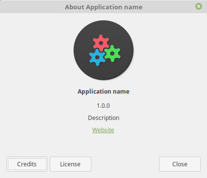
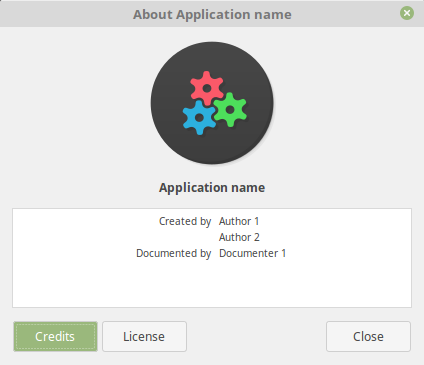

## tuxforms.aboutDialog
```python
def aboutDialog(appName, description, title, website, icon, dialogIcon, versionNumber, license, authors, documenters)
```
|Attribute|Type|Optional?|Default value|Description|Notes|
|---|---|---|---|---|---|
|appName|str|no||Name of the application|
|description|str|yes|`""`|Description of the application|
|title|str|yes|`"About - appName"` (set by GTK, localized)|Title of the window|
|website|str|yes|`240`|Height of the window|
|icon|str|yes|`""`|Icon of the window|
|dialogIcons|str|yes|`""`|Icon of the window|
|versionNumber|str|yes|`""`|Version number of the app|
|license|str or list|yes|`""`|License of the app|list is for `["line 1", "line 2"]` ([`open.readlines`](https://docs.python.org/2/tutorial/inputoutput.html#methods-of-file-objects))
|authors|list|yes|`[]`|Authors of the app|
|documenters|list|yes|`[]`|Documenters of the app|

### Example

```python
# Import tuxforms library
import tuxforms

# Load GPL-3 license from /usr/share/common-licenses/GPL-3
licenseFile = open("/usr/share/common-licenses/GPL-3", "r")
licenseText = licenseFile.readlines()
licenseFile.close()
del licenseFile

# Make about dialog
tuxforms.aboutDialog("Application name", "Description", "", "http://example.com/", "icon", "", "1.0.0", licenseText, ["Author 1", "Author 2"], ["Documenter 1"]);

# Show all windows
tuxforms.ShowAll()
```

#### Result





