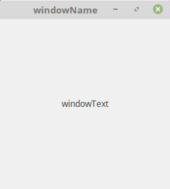

## tuxforms.textDialog
```python
def dialogWithText(text, title, width, height, dialogIcon, windowPosition)
```
|Attribute|Type|Optional?|Default value|Description|
|---|---|---|---|---|
|text|str|no||Text label of the window|
|title|str|yes|`""`|Title of the window|
|width|int|yes|`240`|Width of the window|
|height|int|yes|`240`|Height of the window|
|dialogIcon|str|yes|`""`|Icon of the window|
|windowPosition|str|yes|`"none"`|Position of the window|

### Example

```python
# Import tuxforms library
import tuxforms

# Make text dialog
tuxforms.textDialog("windowText", "windowName", 240, 240, "iconName", "center")

# Show all windows
tuxforms.ShowAll()
```

#### Result

